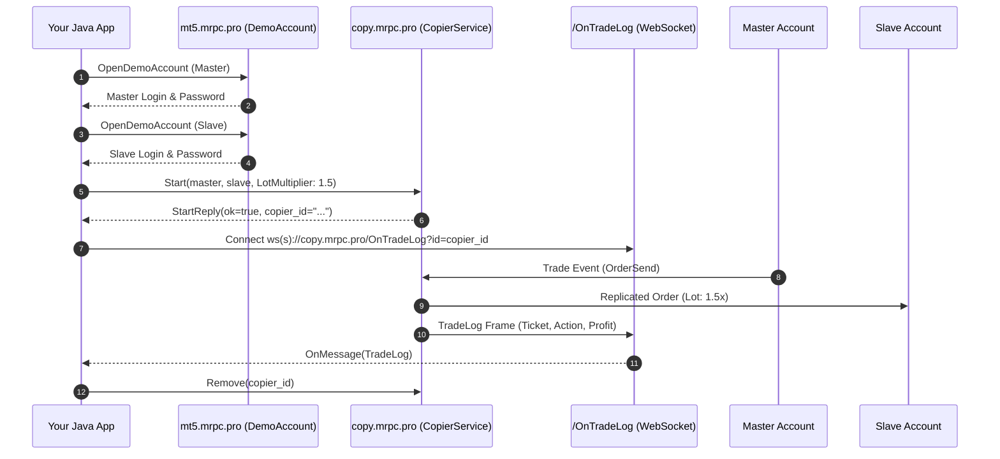

# Quick Start: Your First Project in 10 Minutes

This step-by-step tutorial walks you through building a complete trade replication application in **Java** from scratch using **JavaCopier**.

---

## 1. Overview of Steps

In this guide you will:
1. **Provision two demo MetaTrader accounts** via gRPC (`DemoAccount.OpenDemoAccount`).
2. **Connect to MetaRPC Trade Copier** over HTTP/2 gRPC (`copy.mrpc.pro:443`).
3. **Start an active copier** configured with risk multipliers and SL/TP synchronization.
4. **List all registered copiers** and inspect their state.
5. **Stream real-time trade logs** via WebSocket (`/OnTradeLog?id={copierId}`).
6. **Pause and remove** the copier cleanly.

---

## 2. Complete Runnable Code

```java
package pro.mrpc.copier.examples;

import pro.mrpc.copier.*;
import pro.mrpc.copier.models.*;

public class QuickStart {
    public static void main(String[] args) throws Exception {
        // 1. Provision Demo Accounts via gRPC
        DemoAccountClient demo = new DemoAccountClient("mt5.mrpc.pro:443");
        GuiDemoOpenAccountReply master = demo.openDemoAccount("MetaQuotes-Demo", "Master", "Trader", "master@example.com", "MetaQuotes-Demo");
        GuiDemoOpenAccountReply slave = demo.openDemoAccount("MetaQuotes-Demo", "Slave", "Follower", "slave@example.com", "MetaQuotes-Demo");
        System.out.println("Master: " + master.getLogin() + ", Slave: " + slave.getLogin());

        // 2. Connect to Trade Copier
        CopierService copier = new CopierService("copy.mrpc.pro:443", "YOUR_USER_KEY", "YOUR_MANAGER_KEY");

        // 3. Start Copier
        StartRequest request = StartRequest.newBuilder()
            .setUserKey("YOUR_USER_KEY")
            .setManagerKey("YOUR_MANAGER_KEY")
            .setMaster(Account.newBuilder().setType("MT5").setUser(master.getLogin()).setPassword(master.getPassword()).setServer(master.getServer()).build())
            .setSlave(Account.newBuilder().setType("MT5").setUser(slave.getLogin()).setPassword(slave.getPassword()).setServer(slave.getServer()).build())
            .setRiskType("LotMultiplier")
            .setRiskValue("1.5")
            .setCopySl(true)
            .setCopyTp(true)
            .build();

        StartReply reply = copier.start(request);
        System.out.println("Copier started: " + reply.getCopierId());

        // 4. Query active copiers
        ListReply list = copier.list();
        for (CopierSummary c : list.getCopiersList()) {
            System.out.println("Copier: " + c.getId() + " [" + c.getMasterUser() + " -> " + c.getSlaveUser() + "]");
        }

        // 5. Teardown
        copier.pause(reply.getCopierId(), true);
        copier.remove(reply.getCopierId());
        System.out.println("Copier stopped and removed.");
    }
}
```

---

## 3. How It Works Under the Hood


